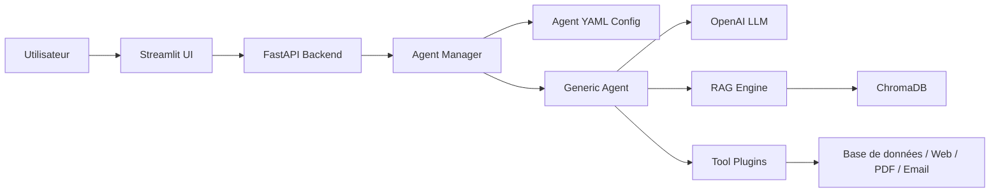

# Plateforme IA Agent

Plateforme professionnelle modulaire d'agents IA, extensible par configuration YAML, sans modification du moteur central.

## Table des matières

- [Fonctionnement général](#fonctionnement-général)
- [Architecture](#architecture)
- [Fonctionnalités](#fonctionnalités)
- [Stack technique](#stack-technique)
- [Démarrage rapide](#démarrage-rapide)
- [Documentation API](#documentation-api)
- [Tests](#tests)
- [Statut du projet](#statut-du-projet)

---

## Fonctionnement général

La plateforme repose sur un principe d'**extensibilité par configuration** : chaque agent conversationnel est défini par un fichier YAML et un prompt système Markdown. Aucune modification du code métier n'est nécessaire pour ajouter un nouvel agent.

Le flux global est le suivant :



1. L'utilisateur envoie un message via l'interface Streamlit ou l'API REST.
2. Le backend authentifie l'utilisateur et récupère l'agent demandé.
3. L'**Agent Manager** charge la configuration YAML de l'agent.
4. Le **Generic Agent** orchestre la génération :
   - Il interroge le LLM (OpenAI) avec le prompt système et l'historique.
   - Il peut utiliser le **moteur RAG** pour enrichir la réponse avec des documents indexés.
   - Il peut exécuter des **outils** (`rag_search`, `sql_query`, `send_email`, `create_pdf`, `search`, `calculator`).
5. La réponse est sauvegardée en base avec les sources et les métriques.

---

## Architecture

L'architecture suit les principes **Clean Architecture** et **SOLID** :

```
ai-agents/
├── app/
│   ├── api/v1/              # Couche présentation : endpoints REST, schémas Pydantic, dépendances
│   │   ├── endpoints/       # chat, agents, documents, health, auth
│   │   ├── app.py           # Application FastAPI
│   │   ├── schemas.py       # Modèles de requête/réponse
│   │   └── dependencies.py  # Dépendances d'injection
│   ├── agents/              # Moteur d'agents YAML
│   │   ├── schemas.py       # Validation stricte Pydantic v2
│   │   ├── loader.py        # Discovery et chargement YAML
│   │   ├── registry.py      # Singleton thread-safe
│   │   ├── factory.py       # Factory + fallback GenericAgent
│   │   ├── manager.py       # Point d'entrée central
│   │   └── generic.py       # Implémentation LangChain par défaut
│   ├── core/                # Configuration centralisée, logging, exceptions
│   ├── database/            # SQLAlchemy 2, session factory
│   ├── frontend/            # Interface Streamlit
│   ├── models/              # ORM SQLAlchemy (User, Conversation, Message, Document, Agent)
│   ├── rag/                 # Moteur RAG complet
│   │   ├── schemas.py       # Modèles de documents et chunks
│   │   ├── chunker.py       # Découpage récursif/markdown
│   │   ├── ingestor.py      # Extraction PDF, DOCX, TXT, MD
│   │   ├── retriever.py     # Recherche sémantique
│   │   └── service.py       # Service métier RAG
│   ├── repositories/        # Pattern Repository (SQLAlchemy)
│   ├── services/            # Services métier (Chat, Document, Agent)
│   ├── tools/               # Plugin tools extensibles
│   │   ├── base.py          # BaseTool abstrait
│   │   ├── registry.py      # ToolRegistry singleton
│   │   ├── manager.py       # ToolManager
│   │   ├── rag_search.py
│   │   ├── sql_query.py
│   │   ├── send_email.py
│   │   ├── create_pdf.py
│   │   ├── search.py
│   │   └── calculator.py
│   ├── utils/               # Sécurité, helpers
│   └── vectorstore/         # Abstraction vectorielle
│       ├── base.py          # BaseVectorStore
│       └── chromadb.py      # Implémentation ChromaDB
├── agents/                  # Configurations YAML des agents
├── app/prompts/             # Prompts système Markdown
├── migrations/              # Alembic
├── tests/                   # Tests unitaires et API
├── data/                    # Données SQLite, ChromaDB, uploads
├── logs/                    # Journaux d'application
├── requirements.txt         # Dépendances
├── pyproject.toml           # Configuration moderne
├── Dockerfile.backend
├── Dockerfile.frontend
├── docker-compose.yml
└── .env.example
```

### Couches applicatives

| Couche | Responsabilité | Composants |
|--------|---------------|------------|
| **Présentation** | API REST + UI | FastAPI, Streamlit, Swagger |
| **Application** | Cas d'usage métier | Services (`ChatService`, `DocumentService`, `AgentService`) |
| **Domaine** | Logique métier | Agents, RAG, Tools, Validations |
| **Infrastructure** | Accès données | SQLAlchemy, ChromaDB, OpenAI |

---

## Fonctionnalités

### 1. Moteur d'agents YAML

- **Zéro code par agent** : chaque agent est défini par un fichier YAML et un prompt Markdown
- **Validation stricte** : Pydantic v2 avec `extra="forbid"`, patterns, ranges
- **Chargement dynamique** : discovery automatique dans le dossier `agents/`
- **Hot reload** : rechargement à chaud via `POST /api/v1/agents/reload`
- **Registry thread-safe** : singleton `AgentRegistry` pour le registre global
- **Factory pattern** : `AgentFactory` avec fallback intelligent vers `GenericAgent`
- **Extensibilité** : possibilité d'ajouter des builders spécialisés

Exemple de configuration YAML :

```yaml
name: maintenance
display_name: Maintenance
description: Assistant spécialisé en maintenance industrielle
model: gpt-4o
temperature: 0.2
max_tokens: 4000
system_prompt: ./app/prompts/maintenance.md
vector_collection: maintenance
database_tables: []
tools:
  - rag_search
  - sql_query
  - create_pdf
is_active: true
```

### 2. Recherche Augmentée (RAG)

- **Ingestion multi-format** : PDF, DOCX, TXT, Markdown
- **Extraction de texte** : `pypdf`, `docx2txt`
- **Découpage intelligent** : `RecursiveCharacterTextSplitter` avec chevauchement configurable
- **Embeddings OpenAI** : `text-embedding-3-small`
- **Stockage vectoriel** : ChromaDB avec collections par agent
- **Recherche sémantique** : similarité cosinus
- **Citation des sources** : métadonnées complètes sur chaque chunk
- **Service RAG unifié** : `RAGService` pour ingestion et recherche

### 3. Plugin d'outils

Système d'outils extensible inspiré de LangChain :

| Outil | Description | Cas d'usage |
|-------|-------------|-------------|
| `rag_search` | Recherche sémantique dans une collection | Questions sur documents internes |
| `sql_query` | Requêtes SQL en lecture seule | Extraction de données métier |
| `send_email` | Envoi d'emails | Notifications automatiques |
| `create_pdf` | Génération de PDF | Rapports, devis, procédures |
| `search` | Recherche web | Informations externes |
| `calculator` | Calculatrice sécurisée | Calculs mathématiques |

- **BaseTool abstrait** : validation d'entrée, exécution sécurisée, schéma JSON
- **ToolRegistry** : enregistrement et découverte des outils
- **ToolManager** : résolution et exécution des outils par nom
- **Permissions** : chaque outil déclare ses permissions requires (`rag:read`, `db:read`, etc.)

### 4. API RESTful

Endpoints principaux :

| Méthode | Endpoint | Description |
|---------|----------|-------------|
| `POST` | `/api/v1/auth/login` | Authentification JWT |
| `POST` | `/api/v1/chat` | Envoyer un message à un agent |
| `GET` | `/api/v1/agents` | Lister les agents |
| `GET` | `/api/v1/agents/{name}` | Détails d'un agent |
| `POST` | `/api/v1/agents/reload` | Recharger les agents |
| `POST` | `/api/v1/documents/upload` | Uploader un document |
| `GET` | `/api/v1/documents` | Lister les documents |
| `GET` | `/api/v1/health` | Santé de l'application |

- **Sécurité** : JWT, dépendances injectées, gestion des erreurs
- **Validation** : Pydantic v2 sur toutes les entrées/sorties
- **Documentation** : Swagger UI (`/docs`) et ReDoc (`/redoc`)

### 5. Interface Streamlit

- **Connexion** : formulaire de login JWT
- **Sélection d'agent** : barre latérale avec description et modèle
- **Chat** : interface conversationnelle avec historique
- **Upload de documents** : formulaire avec paramètres de chunking
- **Sources** : affichage expandable des sources RAG
- **Indicateurs** : tokens utilisés, latence, modèle

### 6. Persistance et sécurité

- **Base de données relationnelle** : SQLAlchemy 2 + SQLite
- **Modèles** : `User`, `Conversation`, `Message`, `Document`, `Agent`
- **Authentification** : JWT avec `python-jose`
- **Hachage** : `bcrypt` via `passlib`
- **Logging** : `Loguru` avec rotation et format structuré
- **Rate limiting** : `SlowAPI` configurable

---

## Stack technique

### Backend

| Composant | Rôle |
|-----------|------|
| **Python 3.12** | Langage principal |
| **FastAPI** | Framework API REST |
| **Uvicorn** | Serveur ASGI |
| **Pydantic v2** | Validation des données |
| **SQLAlchemy 2** | ORM et sessions |
| **Alembic** | Migrations de base de données |
| **OpenAI API** | LLM et embeddings |
| **LangChain** | Orchestration des agents |
| **ChromaDB** | Base de données vectorielle |
| **python-jose** | JWT |
| **bcrypt / passlib** | Hachage des mots de passe |
| **python-multipart** | Upload de fichiers |
| **aiofiles** | I/O asynchrone |
| **slowapi** | Rate limiting |
| **Loguru** | Logging structuré |
| **httpx / tenacity** | Client HTTP et retry |
| **python-magic** | Détection MIME |
| **pypdf / python-docx** | Extraction de texte |

### Frontend

| Composant | Rôle |
|-----------|------|
| **Streamlit** | Interface utilisateur |

### DevOps

| Composant | Rôle |
|-----------|------|
| **Docker** | Conteneurisation |
| **Docker Compose** | Orchestration locale |
| **pytest** | Tests unitaires et d'intégration |
| **Black** | Formatage du code |
| **Ruff** | Linting |
| **Mypy** | Vérification de types |

### Patterns et principes

- **Clean Architecture** : séparation stricte des couches
- **Dependency Injection** : injection de dépendances dans FastAPI
- **Repository Pattern** : accès aux données abstrait
- **Service Layer** : logique métier centralisée
- **Factory Pattern** : création des agents
- **Strategy Pattern** : outils et stratégies de chunking
- **Singleton** : `AgentRegistry` et `ToolRegistry`
- **SOLID** : responsabilité unique, ouvert/fermé, inversion de dépendance
- **DRY / KISS** : pas de duplication, code simple et lisible

---

## Démarrage rapide

### Prérequis

- Python 3.12
- Clé API OpenAI
- Docker et Docker Compose (recommandé)

### Installation

```bash
# 1. Cloner le dépôt
git clone <url-du-depot>
cd ai-agents

# 2. Copier le fichier d'environnement
cp .env.example .env

# 3. Éditer .env et renseigner la clé OpenAI
# OPENAI_API_KEY=sk-votre-cle

# 4. Installer les dépendances
pip install -r requirements.txt

# 5. Initialiser la base de données
python scripts/init_db.py
```

### Lancement

```bash
# Backend
uvicorn app.api.v1.app:app --host 0.0.0.0 --port 8000 --reload

# Frontend (dans un autre terminal)
streamlit run app/frontend/streamlit_app.py
```

### Docker Compose

```bash
docker-compose up --build
```

- Backend : `http://localhost:8000`
- Frontend : `http://localhost:8501`

## Documentation API

- **Swagger UI** : `http://localhost:8000/docs`
- **ReDoc** : `http://localhost:8000/redoc`

## Tests

```bash
pytest tests/ -v
```

Couverture actuelle : **34 tests passent** (agents, RAG, outils, API, sécurité).

## Statut du projet

| Phase | Description | Statut |
|-------|-------------|--------|
| 1 | Foundation (config, DB, modèles) | ✅ |
| 2 | Moteur d'agents YAML | ✅ |
| 3 | Moteur RAG | ✅ |
| 4 | Plugin d'outils | ✅ |
| 5 | API REST | ✅ |
| 6 | Frontend Streamlit | ✅ |
| 7 | Docker, tests, documentation | ✅ |
| 8 | Intégration finale | ✅ |

## License

MIT
